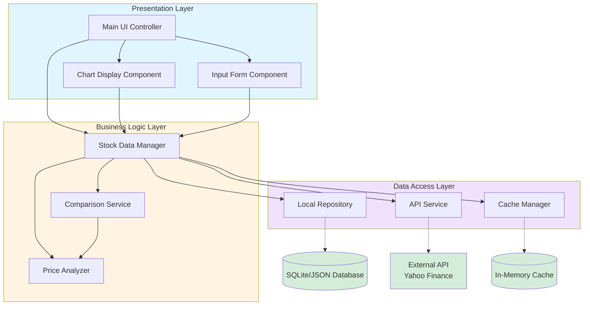
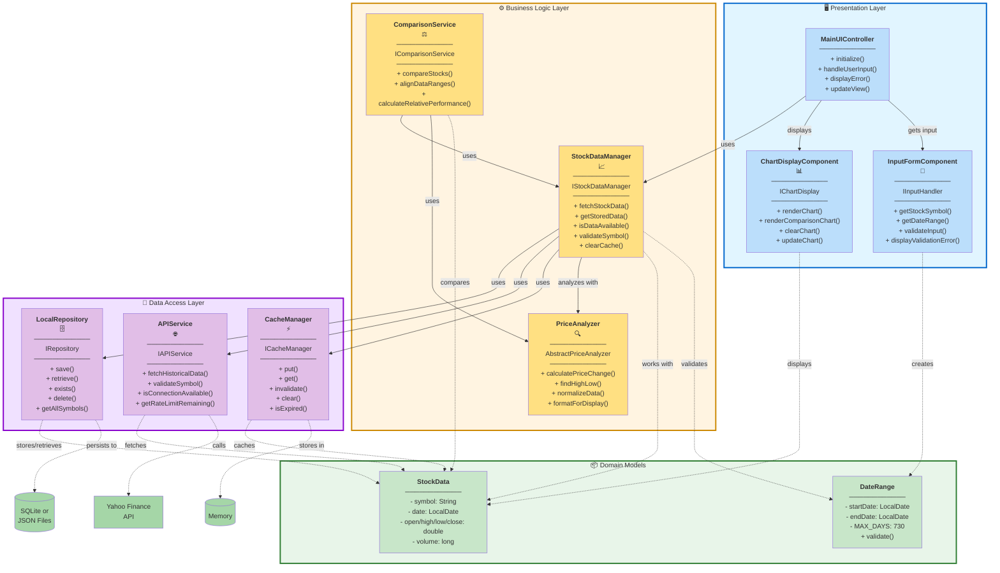
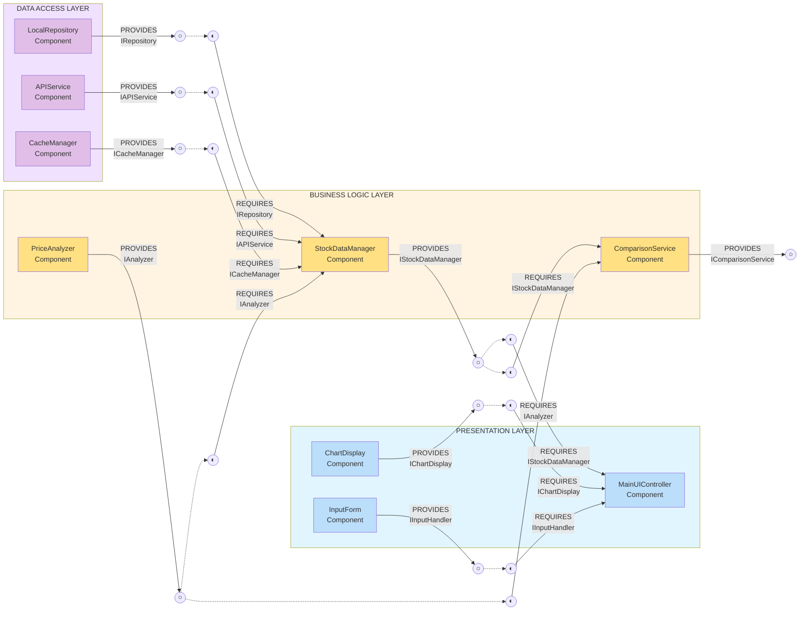

# Architecture Diagrams
**StockCompare Project - Sprint 1**

This folder contains the architectural diagrams for the StockCompare application.

---

## Diagram 1: High-Level Architecture

This diagram shows the overall 3-layer architecture with data flows between components.

**Key Points:**
- **Presentation Layer**: Handles all user interactions and display
- **Business Logic Layer**: Contains core application logic and rules
- **Data Access Layer**: Manages all data storage and retrieval

---

## Diagram 2: Detailed Component Specification

This diagram shows all 9 components with their interfaces and methods.

**Key Points:**
- Each component shows its interface and main methods
- Solid arrows show direct dependencies
- Dashed arrows show data flow
- Color-coded by layer for clarity

---

## Diagram 3: PROVIDED and REQUIRED Interfaces

This diagram shows which interfaces each component **provides** (○) and **requires** (◐).

**Key Points:**
- **○ (Lollipop)**: Interface PROVIDED by the component
- **◐ (Socket)**: Interface REQUIRED by the component
- Dotted lines show interface connections
- This demonstrates **loose coupling** through clear interface contracts

---

## Component Summary Table

| Component | Layer | Provides | Requires |
|-----------|-------|----------|----------|
| **MainUIController** | Presentation | — | IStockDataManager, IChartDisplay, IInputHandler |
| **ChartDisplay** | Presentation | IChartDisplay | — |
| **InputForm** | Presentation | IInputHandler | — |
| **StockDataManager** | Business Logic | IStockDataManager | IRepository, IAPIService, ICacheManager |
| **PriceAnalyzer** | Business Logic | IPriceAnalyzer | — |
| **ComparisonService** | Business Logic | IComparisonService | IStockDataManager, IPriceAnalyzer |
| **LocalRepository** | Data Access | IRepository | — |
| **APIService** | Data Access | IAPIService | — |
| **CacheManager** | Data Access | ICacheManager | — |

---

## Architecture Benefits

✅ **Loose Coupling**: Components depend on interfaces, not concrete implementations  
✅ **Testability**: Easy to create mock implementations for testing  
✅ **Substitutability**: Can swap implementations without changing dependents  
✅ **Scalability**: Easy to add new components or data sources  
✅ **Maintainability**: Clear separation of concerns across layers  

---

## Files in This Directory

- `high-level-architecture.mermaid` - Source file for Diagram 1
- `component-specification.mermaid` - Source file for Diagram 2
- `component-provided-required.mermaid` - Source file for Diagram 3
- `PROVIDED-REQUIRED-SPECIFICATION.md` - Detailed component specifications
- `TEXT_DIAGRAMS.md` - ASCII text versions of diagrams
- `DIAGRAM_GUIDE.md` - Guide for creating and rendering diagrams

---

**Sprint 1 - February 2026**  
**Team**: Anwar, Abdalla, Meshari, Omran
