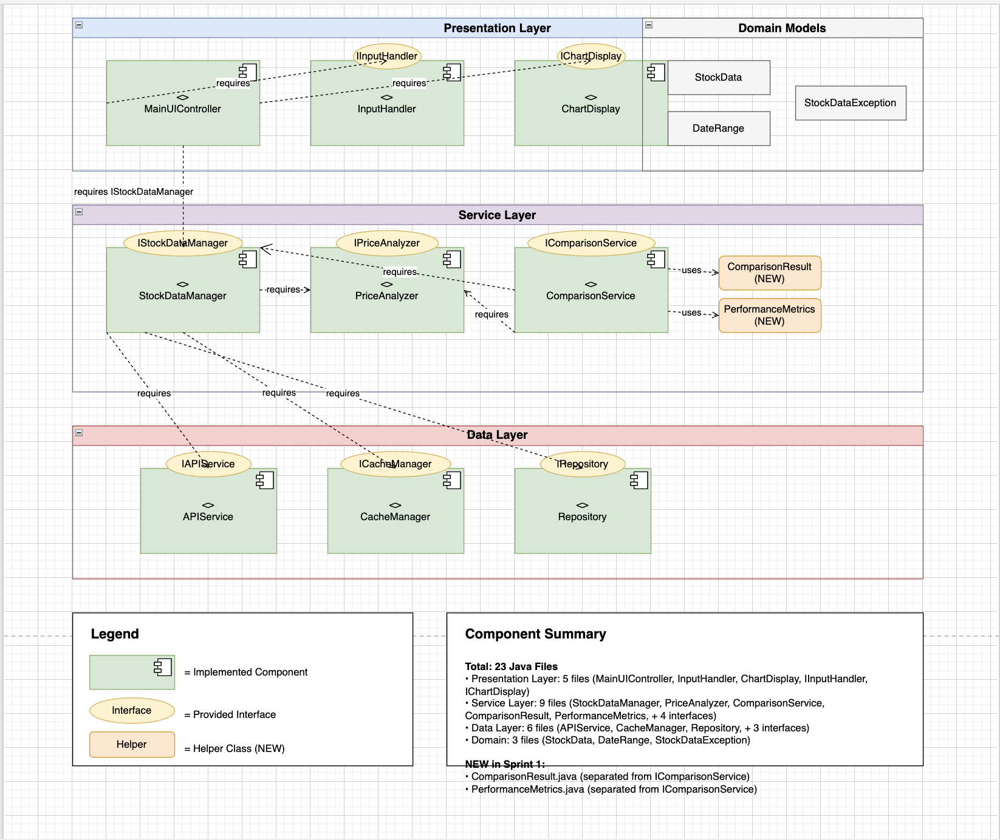
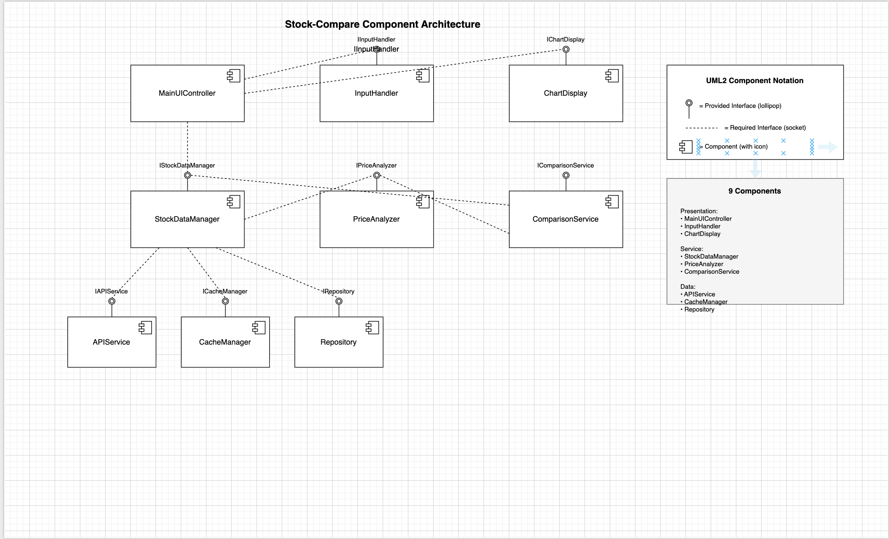

# Component Diagrams

## Detailed Component Diagram

This diagram shows:
- 3 layers (Presentation, Service, Data)
- All 9 components
- All interfaces (lollipops)
- All dependencies (dashed lines)
- Domain models
- Helper classes (ComparisonResult, PerformanceMetrics)

## Simple Component Diagram

Clean UML2 notation showing:
- Component boxes with icons
- Provided interfaces (lollipops)
- Required interfaces (sockets)
- Clear component relationships

## Component Summary
- **Total:** 23 Java Files
- **Presentation Layer:** 5 files
- **Service Layer:** 9 files (includes 2 NEW helper classes)
- **Data Layer:** 6 files
- **Domain:** 3 files
